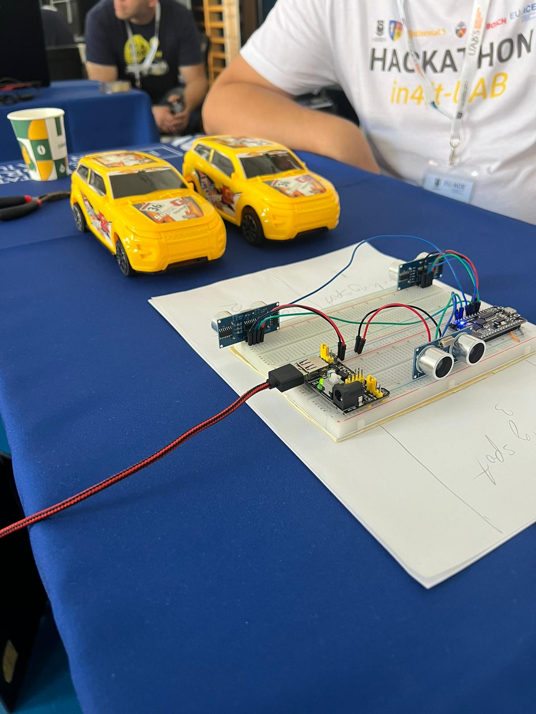
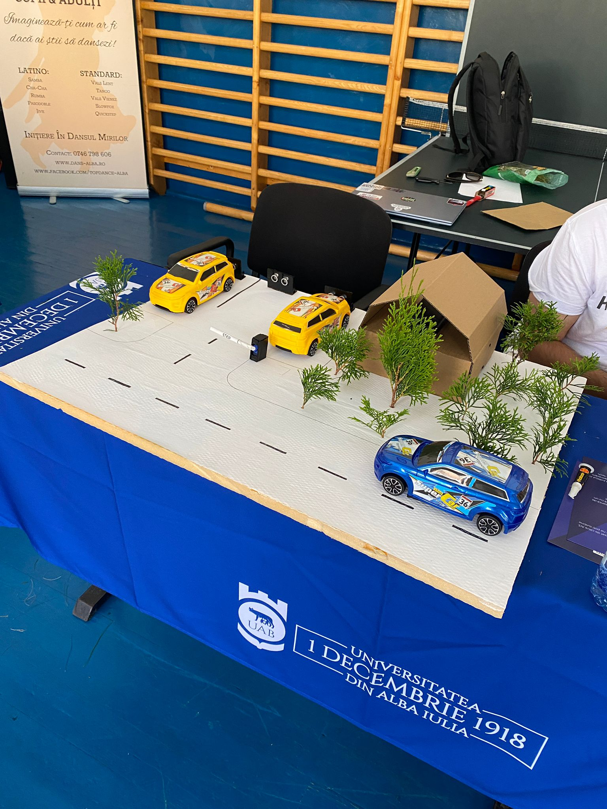
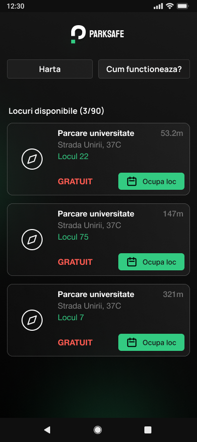
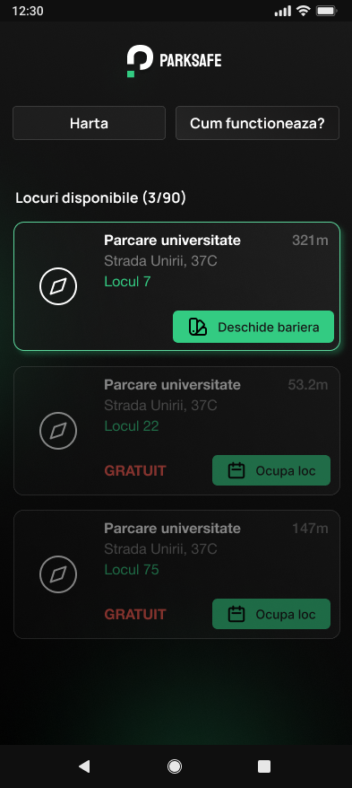

# PARKSAFE

Proiect pentru hackathon in4IT 2024, Universitatea "1 Decembrie 1918" din Alba Iulia  
Tematica: digitalizare

Hardware folosit: modul/microcontroller Wi-Fi ESP8266 cu TCP/IP integrat, 3 senzori ultrasonici de distanta (HC-SR04), motor servo  
Limbaje programare: C, Arduino, React Native/Expo, HTML, CSS (aplicatie mobila)

_[MISSING] De adaugat in repo: codul C/Arduino_

